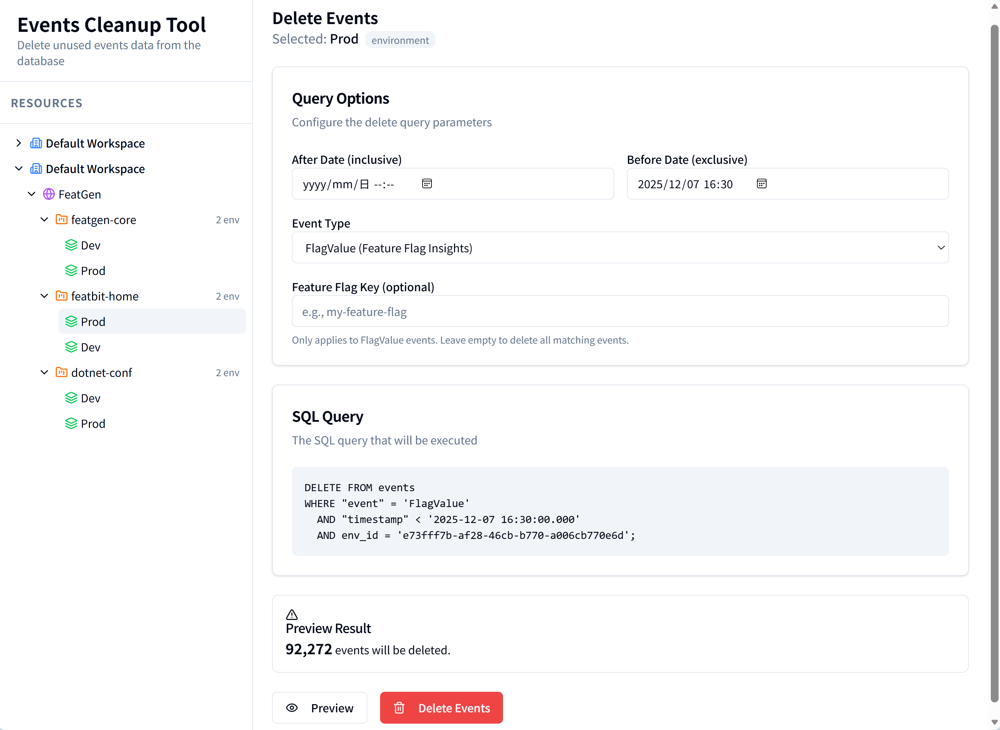

# Truncate Feature Flag Insights Data

FeatBit can records feature flag insights data for abtesting, debugging purposes, and so on. 

Each time a feature flag is evaluated for a specified user (context instance), an event is generated and recorded in the database. This data can include information such as the feature flag key, the user context, the timestamp of the evaluation, and the result of the evaluation (e.g., whether the feature was enabled or disabled for that user).

However, over time, data accumulate in the database, leading to increased storage usage and potential performance degradation. To address this issue, this project demostrates how to truncate insights data from the database.

# Solution

Based on the different database solution you hosted your FeatBit instance, you may have the different way to delete the insights data from the database.

## Run the Solution

Before you read the following instructions, another fast way to understand how the solution works is to launch the projects `EventsCleanupApi` and `webapp` in the folder to try it online.



The running system is composed of two parts:
- `EventsCleanupApi`: An Asp.NET Core Web API project that provides the backend API to preview and delete the insights data from the database.
- `webapp`: A React + TypeScript + Vite project that provides the frontend UI to interact with the backend API.

## Solution Description

### PostgreSQL

The data are stored in the table named `events` in PostgreSQL database. Below is the definition of the `events` table:

```sql
CREATE TABLE events (
	id uuid NOT NULL,
	distinct_id varchar NULL,
	env_id varchar NULL,
	"event" varchar NULL,
	properties jsonb NULL,
	"timestamp" timestamp NOT NULL
);
```

Feature Flag Insights Data Example:

| id | distinct_id | env_id | event | properties | timestamp |
|----|-------------|--------|-------|------------|-----------|
| c2186a72-d009-434a-bb1b-aa41f5fa2384 | ff23468c-dec2-4bca-af50-a90c32c15933 | e73fff7b-af28-46cb-b770-a006cb770e6d | FlagValue |{"envId": "e73fff7b-af28-46cb-b770-a006cb770e6d", "route": "/Variation/GetMultiOptionVariation", "tag_0": "featgen-demo-user-key", "tag_1": "83bb68d7-35ca-465c-815d-18c670953777", "tag_2": "true", "tag_3": "featgen-user", "flagId": "e73fff7b-af28-46cb-b770-a006cb770e6d-batch-project-creation", "userName": "featgen-user", "accountId": "", "projectId": "", "userKeyId": "featgen-demo-user-key", "variationId": "83bb68d7-35ca-465c-815d-18c670953777", "featureFlagKey": "batch-project-creation", "sendToExperiment": true} | 2025-10-02 15:51:24.326 |

**Queries to Truncate Unused Data**

Delete all flag insights data before a specific date:
```sql
DELETE FROM events
WHERE "event" = 'FlagValue' AND "timestamp" < '2025-10-04 13:56:24.138';
```

Delete flag insights for a specific environment and before a specific date:
```sql
DELETE FROM events
WHERE "event" = 'FlagValue'
  AND "timestamp" < '2025-12-07 14:53:00.000'
  AND env_id = 'c05804fe-c802-48f4-8602-b1321dcd8aaf'
  AND "event" = 'FlagValue'
  AND properties->>'featureFlagKey' = 'my-feature-flag';
```

Delete flag insights for a specific project and before a specific date:
1. Find the project you want to delete data for, and get its ID (project_id).
2. Get all environment IDs associated with the project.
```sql
SELECT id FROM environments
WHERE project_id = '{project_id}';
```
3. Delete events for those environment IDs. See the example above for environment-specific deletion.
```sql
DELETE FROM events
WHERE "event" = 'FlagValue'
  AND "timestamp" < '2025-12-07 14:53:00.000'
  AND env_id IN ('c05804fe-c802-48f4-8602-b1321dcd8aaf', 'ff23468c-dec2-4bca-af50-a90c32c15933');
```

For more information, you may run the projects defined in chapter "Run the Solution" to see how it works.


### MongoDB

### ClickHouse 
